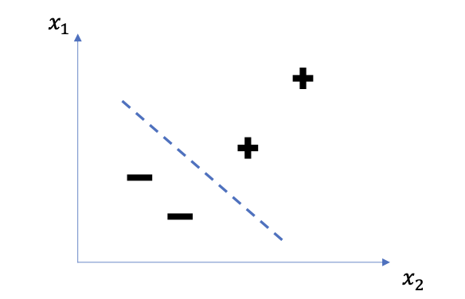
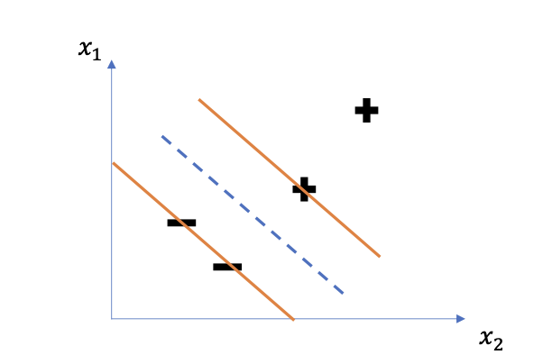
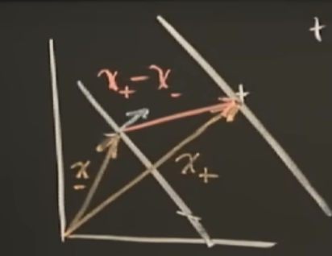

## Support Vector Machines

### Intuition

We have a space with negative and positive examples. The problem is to separate the samples using a straight line. And then line is drawn with the view of putting the widest street that separates the positive from the negative examples

We want to create a decision rules that use that decision boundary

Imagine a vector $\vec{w}$ constraint to be perpendicular to the medium line of the street. And the we have an unkown vector $\vec{u}$ and we are interested in understanding if that vector is on the right side or on the left side of the steet. We can project $\vec{u}$ down to the one that is perpendicular to the street because then, we will have the distance in the $\vec{w}$ direction and the further out we go the closer we'll get to being on the right side of the street.
So we can say
$$
\vec{w} \cdot \vec{u} \geq c
$$

The dot product take the projection onto w and the bigger that projection is, the further out along this projection will lie and eventually it will be so big that the projection crosses the median line of the street, and we'll say it must be a positive sample
Without loss of generality we can say that 

$$
\vec{w} \cdot \vec{u} + b \geq c \space  \text{THEN +}
$$

$$
c = -b
$$
That's our decision rule. 

So we define that for a positive sample this equation is true
$$
\vec{w} \cdot \vec{x_+} +b \geq 1
$$
Likewise for a negative sample

$$
\vec{w} \cdot \vec{x{_-}} +b \leq -1
$$

Let's introduce another variable for mathematical convenience

$y_i$ such that $y_i = 1$ for positive samples and $y_i = - 1$ for negative samples.

So:

$$
y_i(\vec{w} \cdot x_i + b) \geq 1 \\
y_i(\vec{w} \cdot x_i +b) - 1 \geq 0
$$

And 
$y_i(\vec{w} \cdot x_i +b) - 1 \geq 0$ for $x_i$ in the GUTTER

The goal is to arrange for the line to be such at the street separating the pluses from the minuses as wide as possible. So we need to express the distance between the two gutters.

We can consider the difference between the two vectors $\vec{x_+} - \vec{x_-}$ and project the difference to a unit vector that is perpendicular to the straight line.

$$
\text{WIDTH} = (\vec{x_+} - \vec{x_-})\cdot \frac{\vec{w}}{||w||}) 
$$

$$
\frac{(1 - b) + (1 + b)}{||w||} = \frac{2}{||w||}
$$

And this represent the width of the street and we want to maximize that

$\text{MAX} \space \frac{(2)}{||w||}$ equals to $\text{MIN} \space ||w||$ equals to $\text{MIN} \frac{1}{2} ||w||$

In order to maximize the size of the street we're going to maximize the following quantity (lagrange multipliers)

$$
L =  \frac{1}{2} ||\vec{w}||^2 - \sum_{}^{} \alpha_i [y_i(\vec{w} \cdot \vec{x_i} + b) - 1]
$$

So we're going to compute the partial derivative

$$
\frac{\partial L}{\partial \vec{w}} = \vec{w} - \sum \alpha_i y_i x_i = 0 \Rightarrow \vec{w} = \sum_{i} \alpha_i y_i \vec{x_i}
$$

This tells us that the vector $w$ is a linear sum of the samples. 

We can differentiate also for $b$

$$
\frac{\partial L}{\partial b} = - \sum \alpha_i y_i = 0 \Rightarrow \sum \alpha_i y_i = 0
$$

Now that we got a value for $w$ we can substitute the formula in $L$

$$
L = \frac{1}{2}(\sum \alpha_i y_i \vec{x_i})(\sum \alpha_i y_j \vec{x_j}) - \sum\alpha_i y_ix_i(\sum\alpha_j y_j x_j) - \sum\alpha_i y_ib + \sum \alpha_i
$$

And $\sum\alpha_i y_ib = 0$ because of the partial derivative with the respect of b

The Lagrangian can be rewrited as

$$

$$