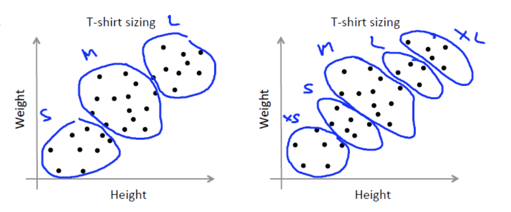
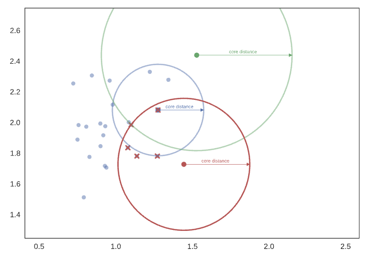

# Table of Contents

## Linear Regression

The basic idea is to understand a specific trend and to represent it with a
mathematical formula such that we are able to apply it to new, unseen, inputs.
Usually we have our data in a tabular form, with a column of attribute features and another
column of outputs and we use this data to train our system.
During the course we will use the following notation:

- m = number of training examples
- x = input variables or features
- y = output variable or target variable
- (x,y) is a tuple representing one training example, and similarly $(x^i,y?^i$ is the i-th training example.


The idea behind linear regression task can be represented as:
We want to realize a function $(h, hypothesis)$ that given a value of x, return the estimated value of y. We can identity two phases: a training time, in
which our algorithm learns from data, and an
inference space, in which we use the hypothesis we
obtained to estimate new outputs.


The simplest hypothesis we can do on the $h$ function is that it is a linear function:

$$
h_{\theta}(x) = \theta_0 + \theta  x
$$

When we have this type of function as the hypothesis function we say we have a linear
regression with one variable, or a univariate linear regression.


Our goal is to minimize error, and to do so first of all we have to represent it an minimize it:

$$
\theta = argmin_{\theta_0, \theta_1} \frac{1}{2m}\sum_{i=1}^{m}(h_{\theta} (x^i) - y^{i})^2
$$

So we compare the value predicted by h with the actual value for each datapoint, we square this prediction errors to avoid having negative errors and then we summ all of this errors (one for each data sample), average the result and then minimize it.
In practice, we define a cost function and try to minimize it by theta:

$$
J(\theta_0, \theta_1) = J(\theta) = \frac{1}{2m}\sum_{i=1}^{m}(h_{\theta} (x^i) - y^{i})^2 \\
\theta_{min} = argmin_{\theta}(J(\theta_0,\theta_1)) = argmin_{\theta}(J(\theta))
$$

### Gradient Descent

**How to find $\theta_0$ and $\theta_1$ to minimize the cost function**

In theory the most rigorous approach would be to calculate partial derivatives and impose
them equal to 0 to find the exact values of the two theta, but sometimes this is not very
computationally feasible and we rely on some computational approach: we initialize $\theta_0$ and $\theta_1$
to some random values and then we keep changing them to reduce the cost function $J(\theta_0,\theta_1)$
to get closer and reach the minimum.
Depending on the initial values, in some more complex situations like neural network, we can
end up in a minimum or in another. Depending on the initial values, in some more complex situations like neural network, we can
end up in a minimum or in another.
We have various approaches to update $\theta_0$ and $\theta_1$ to reach the minimum of the cost function:

#### Algorithm

We start from a random initialization of $\theta_0$ and $\theta_1$ and then we compute the partial derivative of the error function and update the value of the parameters on the basisi of the value of the partial derivative:

$$
\text{ Repeat until convergence }  
\{
    \theta_j := \theta_j - \alpha \frac{\partial}{\partial \theta_j}J(\theta_0, \theta_1) \text{for } j=0 \text{ and } j = 1  \\
\}
$$

Note that the updates of all the parameter must be simultaneous!

$\alpha > 0$ is called the learning rate, is a hyper parameter, a parameter set manually that is not part of the training model.
With some practical example, we can better understand how this algorithm works:


In the first case our partial derivative is posive, so in order to decrease the actual we have to move to the left and so we use the subtract operation.

In the second situation the partial derivative is negative and we have to move to the left so with the subtract operation we move to the right.

The learning rate tells how much should I move from a point to the next nearer to the minimum. If the learning rate is too small I could move too slow on the other hand if it is too big I could be moving too much and the risk is to never converge or even diverge at some point.


Depending on the value of alpha, we have different profiles of the cost function evolution through the different iterations:


#### Gradient descent for linear regression

Now we try to apply the gradient descent algorithm to the linear regression model. So first we have to compute the partial derivatives for the updates:


$$
\frac{\partial}{\partial_j} J(\theta_0, \theta_1) = \frac{\partial}{\partial \theta_j} \frac{1}{2m} \sum_{i=1}^{m}( h_{\theta}(x^{(i)} - y^{(i)}))^2 \\
\frac{\partial}{\partial \theta_j} \frac{1}{2m} \sum_{i = 1}^{m} (\theta_0 + \theta_1 x^{(i)} - y^{(i)})^2 \\
j = 0: \frac{\partial}{\partial \theta_0}J(\theta_0, \theta_1) = \frac{1}{m} \sum_{i=1}^{m}(h_{\theta}(x^{(i)}) - y^{i}) \\
j = 1: \frac{\partial}{\partial \theta_1} J(\theta_0, \theta_1) = \frac{1}{m}\sum_{i=1}^{m}(h_{\theta}(x^{(i)}) - y^{(i)})x^{(i)}
$$


We have a close form for the partial derivatives, and thus we have a close form to evaluate
updates:

$$
\theta_0 := \theta_0 - \alpha \frac{1}{m}\sum_{i=1}^{m}(h_{\theta}(x^{(i)}) - y^{i}) \\
\theta_1 := \theta_1 - \alpha  \frac{1}{m}\sum_{i=1}^{m}(h_{\theta}(x^{(i)}) - y^{(i)})x^{(i)} 
$$
Note that the parameter should be updated simultaneuosly
We repeat this process until we find values that fit our converging criteria.

#### Multiple features

What we’ve done till now has been in the hypothesis that we have only one feature
(parameter) based on which we have to produce our prediction output. Now we have to
expand the theory to multiple features and to do so we have to update the notation:

- m = number of training examples
- n = number of features
- $x^{(i)}$ = input features of the i-th training example
- $y^{(i)}$ = output variable
- $x_j^{i}$ = value of the feature j in the i-th training example

So instead of having just $\theta_0$ and $\theta_1$, we have multiple $\theta$. This means that our jupothesis function is an hyperplane in a n-dimensional space. In general, with n features we have the following hypothesis:

$$
h_{\theta} (x^{(i)}) = \theta_0 + \theta_1 x_1^{(i)} + \theta_2 x_2^{(i)} + ... \theta_n x_n^{(i)}
$$

If we introduce a fake features, namely $x_0$, and we set the values of this feature for all the
training function equal to 1, we can easily see the previous formula as a product of vectors. 

$x_0^{(i)} = 1$

$$\mathbf{X}=\left[\begin{array}{c}\mathbf{x}_{\mathbf{0}} \\ \mathbf{x}_{\mathbf{1}} \\ \mathbf{x}_{\mathbf{2}} \\ \vdots \\ \mathbf{x}_{\mathbf{n}}\end{array}\right] \in \mathbb{R}^{n+1} \quad \theta=\left[\begin{array}{c}\theta_{\mathbf{0}} \\ \theta_{\mathbf{1}} \\ \theta_{\mathbf{2}} \\ \vdots \\ \theta_{\mathbf{n}}\end{array}\right] \in \mathbb{R}^{n+1}$$

$$
\underbrace{\underbrace{\left[\begin{array}{llll}\theta_{\mathbf{0}} & \theta_{\mathbf{1}} & \ldots & \theta_{\mathbf{n}}\end{array}\right]} \underbrace{\left[\begin{array}{c}\mathbf{x}_{\mathbf{0}} \\ \mathbf{x}_{\mathbf{1}} \\ \vdots \\ \mathbf{x}_{\mathbf{n}}\end{array}\right]}_{\mathbf{x}}}_{\theta^T x}
$$

$$
h_{\theta} (x^{(i)}) = \theta_0 + \theta_1 x_1^{(i)} + \theta_2 x_2^{(i)} + ... \theta_n x_n^{(i)} = \theta^Tx.
$$

This allows for a more compact representation of the formulas. 

What we’ve seen until now it is also called **Batch gradient descent**, since we use all the data points of our training set for each upgrade. I process all the batch of data in my possession for every single update step. 
To recap it consists in the following steps:

1. Randomly initialize parameters
2. Repeat until convergence 
    {
    $$
    \theta_j := \theta_j - \alpha \frac{1}{m}\sum_{i=1}^{m} (h_{\theta}(x^{(i)} - y^{(i)}) x_j^{(i)}
    $$
    }

An alternative is the **Stochastic gradient descent**

It consists in the following steps:
1. Randomly initialize parameters
2. Repeat until convergence {
    for each training case {
        $$
        \theta_{j} := \theta_j - \alpha(h_{\theta}(x^{(i)}) - y^{(i)})x_j^{(i)}
        $$
    }
}

In this algorithm we randomly initialise the parameters, just like in the previous algorithm, but instead of using the whole batch for each upgrade, we upgrade our parameters after each datapoint. We call it stochastic because in this case gradient is a "stochastic approximation" of the "true" cost gradient.
It is possible possible to find convergence in this stochastic version of the gradient descent in much less time, but convergence is not guaranteed.
Comparing the behaviours of the two algorithms:


#### BATCH GD PSEUDOCODE

```
theta = rand();
while (not convergence) {
    # iteration over theta parameters
    for( j from 1 to n){
        update = 0;
        # iteration over training samples
            for( i from 1 to m) {
                update = update + (h(x[i]) - y[i]) x[i];
            }
        theta_new[j] = theta[j] – alpha * update / m;
    }
    theta = theta_new;
}
```
#### STOCHASTIC GD PSEUDOCODE

```
theta = rand();
while (not convergence){
    # iteration over training samples
    for(i from 1 to m) {
        # iteration over theta parameters
            for(j from 1 to n){
                theta_new[j] = theta[j] – alpha * (h(x[i]) - y[i]) x[i];
            }
        theta = theta_new;
    }
}
```

#### MINI BATCH GRADIENT DESCENT

It’s a compromise between the last two algorithms. The dataset is divided in mini-batches of a fixed length ($b$ with $1<b<m)$ and we update $\theta_s$ based on the error of these mini-batches. In
this way we combine the best of both worlds and we obtain both convergence and speed.
In this way it reduces the variance of the parameter updates, leading to more stable convergence (more robust), and allows the use of vectorization libraries rather than computing each step separately (more efficient).
The implementation is the following: 

```
b = 50;
while (not convergence){
    # iteration over training samples
    while(i < m){
    # iteration over theta parameters
        for(j from 1 to n){
            update = 0;
            # iteration over the b samples
            for( z from i to i + b ){
                update = update + (h(x[z]) - y[z]) x[z];
            }
            theta[j] = theta[j] – alpha * update / b;
        }
        i = i + b;
    }
}
```
### LINEAR REGRESSION FOR MULTIPLE VARIABLES 

Till now, what we’ve seen is linear regression were the hypothesis is a linear function. Linear regression is used for many many tasks and it is useful also to have a rough idea of the behaviour of a dataset.
Even it is conceived to be a linear model, it can be adapted also to consider more complex model, such as a polynomial model.

The rough idea is to add new artificial features to our dataset.
E.g. If we think about our house pricing example, let’s say we have the following hypothesis:

$$
h_{\theta} (x^{i}) = \theta_0 + \theta_1 \cdot front^{(i)} + \theta_2 \cdot side^{(i)}
$$

Maybe the front and side values are not very informative, but their product, the area, might be.
In substance we are adding a quadratic term.
What i do is computing a new feature whose values are the areas given fronts and sides for
each datapoint. We do not care that this feature is obtained as a quadratic term, we just
consider it as a parameter:

$$
h_{\theta}(x^{(i)}) = \theta_0 + \theta_1 \cdot area^{(i)}
$$

Similarly we can consider the following polynomial hypothesis: 

$$
\theta_0 + \theta_1x + \theta_2 x^{2} + \theta_3x^{3}
$$

So I can basically create new artificial features:

$$
x_1^{(i)} = (area) \\
x_2^{(i)} = (area)^2\\
x_3^{(i)} = (area)^3
$$

In this way what i get as an hypothesis is: 

$$
h_{\theta(x^{(i)})} = \theta_0 + \theta_1 x_1^{(i)} + \theta_2 x_2^{(i)} + \theta_3 x_3^{(i)} \\
= \theta_0 + \theta_1 (area^{(i)}) + \theta_2 (area^{(i)})^2 + \theta_3 (area^{(i)})^3
$$

In this way i can apply the simple theoretical structure i already know to a polynomial
hypothesis.

### FEATURE SCALING
#### Linear regression with polynomial model 
#### Stopping condition
The stopping condition is usually a design choice:
We have multiple options:
- Max iteration: the algorithm stops after a fixed number of iterations
- Absolute tolerance: the algorithm stops when a fixed value of the cost function is reached;
- Relative tolerance: the algorithm stops when the decreasing of the cost function w.r.t. the previous step is below a fixed rate
- Gradient Norm tolerance: the algorithm stops when the norm of the gradient is lower than a fixed value.

## Support Vector Machines

We have a space with negative and positive examples. The problem is to separate the samples using a straight line. And then line is drawn with the view of putting the widest street that separates the positive from the negative examples. (The margin that I drawn is the smallest distance to the closest point)
 


We want to create a decision rules that use that decision boundary

Imagine a vector $\vec{w}$ constraint to be perpendicular to the medium line of the street. And the we have an unkown vector $\vec{u}$ and we are interested in understanding if that vector is on the right side or on the left side of the steet. We can project $\vec{u}$ down to the one that is perpendicular to the street because then, we will have the distance in the $\vec{w}$ direction and the further out we go the closer we'll get to being on the right side of the street.
So we can say
$$
\vec{w} \cdot \vec{u} \geq c
$$

The dot product take the projection onto w and the bigger that projection is, the further out along this projection will lie and eventually it will be so big that the projection crosses the median line of the street, and we'll say it must be a positive sample.
Without loss of generality we can say that 

$$
\vec{w} \cdot \vec{u} + b \geq c \space  \text{THEN +}
$$

$$
c = -b
$$
That's our decision rule. 

So we define that for a positive sample this equation is true
$$
\vec{w} \cdot \vec{x_+} +b \geq 1
$$
Likewise for a negative sample

$$
\vec{w} \cdot \vec{x{_-}} +b \leq -1
$$

Let's introduce another variable for mathematical convenience

$y_i$ such that $y_i = 1$ for positive samples and $y_i = - 1$ for negative samples.

So:

$$
y_i(\vec{w} \cdot x_i + b) \geq 1 \\
y_i(\vec{w} \cdot x_i +b) - 1 \geq 0
$$

And 
$y_i(\vec{w} \cdot x_i +b) - 1 = 0$ for $x_i$ in the GUTTER

The goal is to arrange for the line to be such at the street separating the pluses from the minuses as wide as possible. So we need to express the distance between the two gutters.

We can consider the difference between the two vectors $\vec{x_+} - \vec{x_-}$ and project the difference to a unit vector that is perpendicular to the straight line.


$$
\text{WIDTH} = (\vec{x_+} - \vec{x_-})\cdot \frac{\vec{w}}{||w||}) 
$$

$$
\frac{(1 - b) + (1 + b)}{||w||} = \frac{2}{||w||}
$$

And this represent the width of the street and we want to maximize that quantity

$\text{MAX} \space \frac{2}{||w||}$ equals to $\text{MIN} \space ||w||$ equals to $\text{MIN} \frac{1}{2} ||w||^2$. We have also a contraint that is:

$$ 
y_i(\vec{w} \cdot x_i + b) \geq 1 \\
$$

We’ve now transformed the problem into a form that can be efficiently
solved. The above is an optimization problem with a convex quadratic objective and only linear constraints. Its solution gives us the optimal margin classifier.

### Lagrange duality
Consider a problem of the following form:
$$
min_w f(w) \\
\text{s.t} \space h_i(w) = 0, i = 1,...,l
$$
This problem can be solved with a method called the Lagrange multipliers. The Langrangian is defined to be:

$$
L(w,\beta) = f(w) + \sum_{i}^{l}\beta_i h_i(w)
$$


Here, the $\beta_i$'s are called the **Lagrange multipliers**. We would then find and set $L$'s partial derivatives to zero

$$
\frac{\partial L }{\partial w_i} = 0; \space \frac{\partial L}{\partial \beta_i} = 0
$$

and solve for $w$ and $\beta$.
### Primal optimization problem

In this section, we will generalize this to constrained optimization problems in which we may have inequality as well as equality contraints. Due to 
In order to maximize the size of the street we're going to maximize the following quantity (lagrange multipliers)
$$
min_w f(w) \\
\text{s.t} \space g_i(w) \leq 0, \space i = 1,...,k \\
h_i(w) = 0, \space i = 1,...,l.
$$
To solve it, we start by defining the **generalized Lagrangian**

$$
L(w, \alpha, \beta) = f(w) + \sum_{i = 1}^{k}\alpha_i g_i(w) + \sum_{i=1}^l(\beta_i h_i(w))
$$

Here, the $\alpha_i$'s and $\beta_i$'s are the Lagrange multipliers.  The generalized Lagrangian correspond to the dual problem

$$
\text{maximize} \space L(w,\alpha, \beta) \space \text{s.t} \space \alpha \geq 0
$$

In our case we have that:

$$
L =  \frac{1}{2} ||\vec{w}||^2 - \sum_{}^{} \alpha_i [y_i(\vec{w} \cdot \vec{x_i} + b) - 1]
$$

So we're going to compute the partial derivative

$$
\frac{\partial L}{\partial \vec{w}} = \vec{w} - \sum \alpha_i y_i x_i = 0 \Rightarrow \vec{w} = \sum_{i} \alpha_i y_i \vec{x_i}
$$

This tells us that the vector $w$ is a linear sum of the samples. 
**BUT NOT ALL** the samples, because some alphas could be zero.
We can differentiate also for $b$

$$
\frac{\partial L}{\partial b} = - \sum \alpha_i y_i = 0 \Rightarrow \sum \alpha_i y_i = 0
$$

If we compute the differentation also for alpha

$$
L = \frac{1}{2}||\vec{w}||^2 - \sum\alpha_i[y_i(\vec{w}\cdot \vec{x_i} + b) - 1] \\
\\
\frac{\partial L}{\partial \alpha} = [y_i(\vec{w}\cdot \vec{x_i} + b) - 1] = 0
$$

Now that we got a value for $w$ we can substitute the formula in $L$

$$
L = \frac{1}{2}\left(\sum\alpha_i y_i \vec{x_i}\right)\left(\sum\alpha_i y_j \vec{x_j} \right) - \sum\alpha_i y_ix_i \left(\sum\alpha_j y_j x_j \right) - \sum\alpha_i y_ib + \sum \alpha_i
$$

And $\sum\alpha_i y_ib = 0$ because of the partial derivative with the respect of b

The Lagrangian can be rewrited as

$$
L = \sum \alpha_i - \frac{1}{2}\sum_{i} \sum_{j} \alpha_i \alpha_j y_i y_j \vec{x_i}\cdot \vec{x_j}
$$

We're trying to find a maximum of $L$ and what I discovered that the optimization depends only on the dot product of pairs of samples $x_i\cdot x_j$ 
So now, my decision rule with this expression for w is going to be
$$
\sum \alpha_i y_i \vec{x_i}\cdot \vec{u} + b \geq 0 \rightarrow +
$$

So we discovered that the decison rules depends only on the dot product of those sample vectors and the unknown.

### Non Linear separable data


The derivation of the SVM as presented so far assumed that the data is linearly separable. When data are non-linearly separable, we may get a separation between classes with a hyperplane only allowing that, after having defined the separating hyperplane, some pattern of the training set with positive label are classified as negative and viceversa. We must accept that some constraints are **violated**

We introduce a **slack** variable $\xi_i$ for each constraint, in order to allow an error tolerance:
$$
y^{(i)}(w^{T}\cdot x^{i} + b) \geq 1 - \xi^{i}
$$
An additional term C is introduced in the cost function to penalize misclassification errors.

$$
\frac{1}{2}||w||^2 + C \sum_{i=1}^m\xi^{(i)}
$$

The $\xi_i$ are cost variables proportional to how far the misclassified pattern is from the hyperplane. $\xi_i > 1$ indicates a misclassification error.

C (**regularization** parameter) lets to control the trade-off between hypothesis space complexity and the admissible number of errors. A big value for C gives a stronger penalization to errors. The optimization problem to solve becomes:

Minimize: 
$$
\frac{1}{2}||w||^2 + C \sum_{i=1}^m\xi^{(i)} \\
\space \text{s.t} \\
y^{i}(w^{T}\cdot x^{i} + b) \geq 1 - \xi^{(i)} \\
\xi^{(i)} \geq 0
$$
The dual problem now becomes:

$$
max_{\alpha} \sum_{i=1}^{m}\alpha_i - \frac{1}{2}\sum\alpha_i\alpha_j y_i y_j x_i^T x_j \\
\text{s.t. } 0\leq \alpha_i \leq C \text{ and }  \sum_{i=1}^{m}\alpha_i y_i = 0
$$
The dual variables are now bounded with C. The proposed solution could not be enough. It does not guarantee good performances since a hyperplane can only represent a dichotomy in the space of instances/patterns.

### Cover's theorem
Cover's theorem state that, a complex pattern classification problem, cast in a high dimensional space nonlinearly, is more likely to be linearly separable than in a low dimensional space, provided that the space is not densely populated.
Or in simple terms, given a set of training data that is not linearly separable, one can transform it into a training set that is linearly seperable by mapping it into a possibly higher dimensional space via some non linear transformation.


1. Patterns (input space) are mapped into a space with (much) higher dimension (feature space) through kernel functions;
2. The optimal hyperplane is defined within this feature space


In this case the samples are not linearly separable and we are not able to find a solution for our problem, but we can move to another space that is more convenient for our purposes:

$$
\vec{x} \Rightarrow\phi(\vec{x})
$$

For our optimization problem now all we need is a function $K$ that corresponds to the dot product between the samples in the new space.

This function $K$ is called **kernel function** and we have no need to compute the transformation function $\phi(\vec{x_i})$
$$
K(x_i,x_j) = \phi({\vec{x_i}})\cdot \phi(\vec{x_j})
$$

### Kernel trick
To solve the optimization problem, the product $\phi({\vec{x_i}})\cdot \phi(\vec{x_j})$ does not have to be explicitly computed in the feature space once we find a kernel function (specifically a positive definite kernel).

$$
K(x_i,x_j) = \phi({\vec{x_i}})\cdot \phi(\vec{x_j})
$$

The kernel is a function that returns the (scalar) product of projections: it avoids you to explicitly compute the projection and make the product between the projected vectors. The explicit form of the transformation function may be ignored.

If a kernel function is defined, that is a function such that: 
$$
K(x_i,x_j) = \phi({\vec{x_i}})\cdot \phi(\vec{x_j}) = \sum_{k=1}^{m}\phi(\vec{x_i})\cdot(\phi(\vec{x_j}))
$$

The optimization problem becomes:

$$
max_{\alpha}\sum_{i=1}^{m}\alpha_i - \frac{1}{2}\sum_{i,j = 1}^{m} \alpha_i\alpha_j y_i y_j k(x_i,x_j) 
$$
Such that:

$$
0 \leq \alpha_i \leq C \text{ and } \sum_{i=1}^{m}\alpha_i y_i = 0
$$

The projection $\phi(\vec{x_i})$ into the feature space must not be explicitly computed. 
I should compute the scalar product $\phi(\vec{x_i})\cdot(\phi(\vec{x_j}))$, but I don't have to, since I can indirectly obtain it with the kernel function.

### Kernel examples
Linear kernel

$$
(\vec{u}\cdot \vec{v})
$$

Polinomial kernel

$$
(\vec{u}\cdot \vec{v} + 1)^d
$$

Multi-Layer Perceptron tanh

$$
tanh(b(\vec{u}\cdot\vec{v} - c))
$$

Radial basis function (RBF) kernel 

$$
e^{- \frac{||x_i - x_j||}{\sigma}}
$$

Gaussian Radial basis function kernel

$$
e^{- \frac{(x_i - x_j)^2}{2\sigma^2}}
$$

### Parameters tuning
To use Support Vector Machines you have to define
- the kernel function;
- potential parameter of the kernel function;
- The value for the regularization parameter C.

General rules for the set up do not exist, but you should make your choice on a validation set, usually through cross validation.

### Advantages of SVMs
- There are no local minima (the optimization problem is quadratic -> $\exists$ ! optimal solution)
- The optimal solution can be found in polynomial time.
- There are few parameters to set up (C, type of kernel and specific kernel parameters)
- Solution is stable (ex. there is no problem of randomly initializing of weights just as in Neural Networks)
- Solution is sparse: it just involves support vectors

### SVM Online resources
- https://www.youtube.com/watch?v=_PwhiWxHK8o
- https://www.youtube.com/watch?v=xpHQ6UhMlx4

## Generalized Linear Models
### Basic functions

It is usual that our data cannot be approximated to a linear function. What we need is to find a way to model non linear relations without increasing too much the complexity of the algorithm.

The main limiting characteristics of linear regression is the linearity of parameters

$$
h(x) = \sum_{i = 0}^n \theta_i \cdot x_i = \theta^T x
$$
h(x) keeps a linear relation w.r.t the features space X. This linearity represents a limitation of the expressiveness of the model because the hypothesis is only able to approximate linear functions of the input. GLMs represent an extension to linear models that allow non linear transformations of the input
$$
h(x) = \sum_{i=0}^{n}\theta_i \cdot x_i = \theta^Tx
$$

h(x) keeps a linear relation w.r.t the features space X. This linearity represents a limitation of the expressiveness of the model because the hyporthesis is only able to approximate linear functions of the input. GLMs represent an extension to linear models that allow nonlinear transformations of the input

$$
h(x) = \sum_{i=0}^{n}\theta_i \cdot \psi(x_i) = \theta^T \psi(x)
$$

Phi are called basic functions
Example $x_i,x_2,x_3 \rightarrow x_1,x_2,x_3,x_1x_2,x_1x_3,x_1^2,x_2^2,x_3^2$

## SVM notes from Waterloo lecture
Support vector machines will find a linear separator such that we have the same distance for point on one side and point of the other side and line is gonna be right in the middle. The point that are the closest are called support vector.
And support vector tells us where to put the line such as it has the same distance and distance is the maximum we can obtain. 


## Unsupervised Learning (Stanford CS229 Notes)

### K-Means
In the supervised setting we get points with labels that we can separate with a line and with a supervised learning algorithm. In unsupervised we have the points but we don't have the labels. Unsupervised learning is harder so we have to allow stronger assumptions and we're gonna have to assume that there are some kind of latent or hidden structure and we're gonna have to allow weaker guarantees. (Guess number of cluster for example and assume that there is some cluster in our data).

So we have some data and set up the number of cluster e.g $K=2$ and our goal is to find the cluster.
So given a dataset with points $x^{(1)} \text{ ... } x^{(n)} \in \mathbb{R^d}$ and $K$ # of cluster, we find an assignment to point to cluster in this way $C^{(i)} = j$ means that the point i belong to cluster j. Where i = 1 ... n and j = 1 ... k.


So we start assigning points to cluster, for example $C^{(3)} = 2$ means that point 3 is in cluster 2.

#### How do we find the clusters?


We use and iterative approach. So we're going to start by randomly picking cluster centers for each cluster and find the optimal one in which all the points belonging to the cluster are closer to the center than they are to any other center. 
So the first step of the algorith is
1. Randomly initialize center cluster points $\mu^{(1)}$ and $\mu^{(2)}$ (They don't have to be point in the dataset)
2. Assign each point to a cluster by considering the distance to each center cluster $C^{(i)} = argmin_{j=1...k} ||\mu^{(j)} - x^{(i)}||^2$
3. I compute new cluster centers

And I repeat the step 2 and step 3 until there are no more changes.
The cluster center can be computed in this way
$$
\mu^{(j)} = \frac{1}{|\Omega_j|} \sum_{i \in \Omega_j} x^{(i)} \text{ s.t } \Omega_j = {i:C^{(i)} = j}
$$

Notice that if the point assignment doesn't change in step 2 the center will not change (step 3).

The first question is: Does it terminate? and the answer is yes. 

$$
J(C,\mu) = \sum_{i=1}^N ||x^{(i)} - \mu^{C^{(i)}}||^2
$$
That is, the distance between a point and its cluster center is actually monotonically decreasing. So the oscillation can happen (you can basically do grandient descent on this) but it converges to something but it does not converge necessarily to a global minimizer

#### How do you choose k?

There is no one right answer (modeling question).

#### Professor slide 


**Objective Function(L)**
The K-means algorithm aims to minimize the within-cluster sum of squares, which measures the distance between each data point $x^{(i)}$ and the centroid $\mu_k$ of the cluster it belongs to.
The objective function is defined as:

$$
L = \sum_{k=1}^{K}\sum_{i=1}^{m} a_{ik}||x^{(i)} - \mu_k||^2
$$

- $K$: The number of clusters.
- $m$: The number of data points.
- $a_{ik}$: A binary variable, which is 1 if data point $x^{(i)}$ is assigned to cluster k, and 0 otherwise.
- $x^{(i)}$ : The i-th data point in the dataset
- $\mu_k$: The centroid (mean) of the k-th cluster

The algorithm attempts to minimize L, which is the total sum of squared distances between each data point and the centroid of the cluster of which it belongs.

**Expectation Step**

In this step, the algorithm assigns each data point $x^{(i)}$ to the nearest cluster centroid $\mu_k$. Mathematically, it computes the binary assignment variable $a_{ik}$:

$$
a_{ik} = 
\begin{cases}
1 \text{ if k = arg min}_l ||x^{(i)} - \mu_l||^2 \\
0 \text{ otherwise }
\end{cases}
$$

This means that for each data point, the cluster index k is chosen such that the distance between the point $x^{(i)}$ and the centroid $\mu_k$ is minimized. The variable $a_{ik}$ will be 1 if the point is assigned to cluster k, and 0 otherwise.

**Maximization Step**

Once the assignments are made, the centroids of the clusters are updated to reflect the new mean position of the points in each cluster. The update for the $k-th$ cluster centroid $\mu_k$ is given by:

$$
\mu_k = \frac{1}{n_k}\sum_{i:x_i\in C_k}x^{(i)}
$$

- $n_k = \sum_{i=1}^{m} a_{ik}$: The number of points assigned to cluster k.
- $C_k$: The set of points assigned to cluster k.

The new centroid $\mu_k$ is the average of all the points currently assigned to cluster k. This update ensures that the centroid moves towards the center of the points assigned to it.

**Iteration**
The algorithm repeats the Expectation Step and the Maximization step alternately:
1. In the Expectation Step it assigns points to the nearest cluster.
2. In the M-step, it updates the cluster centroids to the mean of the assigned points.

This process continues until the assignments no longer change, meaning the algorithm has

### Multivariate Gaussian

A **Multivariate Gaussina distribution** extends the concept of a normal distribution to multiple dimension. It is characterized by a **mean vector** and a **covariance matrix**.
#### Gaussian (Normal) distribution


In a Gaussian (Normal) distribution we have $x \in \mathbf{R}$ that is our random variable and $x$ has a Gaussina distribution with mean $\mu$ and variance $\sigma^2$. We can express this fact with this notation $x \sim \mathcal{N}(\mu, \sigma^2)$.
The formula for the probability is 

$$
p(x;\mu,\sigma^2) = \frac{1}{\sqrt{2\pi}}e^{\frac{-(x - \mu)^2}{2\sigma^2}}
$$

##### Parameters estimation

Given a dataset : ${x^{(1)},x^{(2)},...,x^{(m)}}$
We can compute the empirical mean and variance by:

$$
\mu = \frac{1}{m}\sum_{i=1}^{m} x^{(i)} \\
\sigma^2 = \frac{1}{m}\sum_{i=1}^{m}(x^{(i)} - \mu)^2
$$

#### Multivariate Gaussian (Normal) distribution

For the multivariate case we define the following quantities

$$
x \in \mathbf{R^n} \\
\mu \in \mathbf{R^n} \\
\sum \in \mathbf{R^{nxn}} \text{ covariance matrix }
$$

And our probability will be:

$$
p(x;\mu;\sum) = \frac{e^{\left(-\frac{1}{2}(x - \mu)^T \sum^{-1}(x-\mu)\right)}}{\sqrt{(2 \pi)^n |\sum|}}
$$

##### Example: Height and Weight in a Population (Optional Reading)

Let's assume we want to model the height and weight of individuals in a population using a 2D multivariate Gaussian distribution. We'll desribe the joint distribution of these two variables using:
- A  mean vector representing the average height and weight
- A covariance matrix representing the variance in height, variance in weight, and how the two variables are correlated.

1. Mean Vector

The mean vector $\mu$ consist of the mean of the two variables:
$$
\mu = 
\left[
    \begin{aligned}
    & \mu_{height} \\
    & \mu_{weight} \\
    \end{aligned}
\right]
$$

For example:

$$
\mu = 
\left[
    \begin{aligned}
    & 170 \text{ cm (average height)} \\
    & 70 \text{ kg (average weight)} \\
    \end{aligned}
\right]
$$

2. Covariance Matrix

The covariance matrix $\sum$ contains information about the variances of each variable and their covariance:

$$
\sum = 
\begin{bmatrix}
\sigma_{height^2} & Cov(height, weight) \\
Cov (height, weight) & \sigma_{weight}^2
\end{bmatrix}
$$

- $\sigma_{height}^2$ = $100cm^2$ that is the variance of height, so standard deviation of height $\sigma_{height} = 10 cm$

- $\sigma_{weight}^2$ = $225kg ^2$ that is the variance of weight, so standard deviation of height $\sigma_{weight} = 50$

###### Interpretation
- The covariance matrix indicates that height and weight are positively correlated (Covariance = 50). Taller individuals tend to weigh more.
A positive covariance means that when one variable (height) increases, the other variable (weight) also tends to increase.

For a population described by this bivariate Gaussian distribution:

- Average height = 170 cm
- Average weight = 70 kg
- Height standard deviation = 10 cm
- Weight standard deviation = 15 kg
- Positive correlation between height and weight (Covariance = 50).

If you plot a 2D contour of this distribution, it would look like elliptical contours centered around the mean vector (170 cm, 70 kg), with the major axis of the ellipse tilted due to the positive correlation between height and weight.

The major axis of the elliptical contours in a Multivariate Gaussian distribution is determined by the direction of the greatest variance (or spread) of the data. To determine whether the major axis is aligned more with weight or height, we need to look at both the variances and the covariance between the two variables.

In our example we have that

$$
\sum = 
\begin{bmatrix}
100 & 50 \\
50 & 225
\end{bmatrix}
$$

1. Variance Comparison: The variance in weight (225) is larger than the variance in height (100). This suggests that there is more spread in the weight data than in the height data, which is an initial clue that the major axis might be aligned more with weight.

2. Covariance: The positive covariance (50) between height and weight indicates that the two variables are positively correlated. This means that when height increases, weight tends to increase as well. The ellipse is tilted upward due to this correlation.

###### Eigenvalues and Eigenvectors

To rigorously determine the direction of the major axis, we would compute the eigenvalues and eigenvectors of the covariance matrix $\Sigma$ . The eigenvectors give the direction of the principal axes (major and minor), and the eigenvalues indicate the magnitude of variance along these axes.

1. Larger eigenvalue: Corresponds to the major axis (the direction of maximum variance).

2. Smaller eigenvalue: Corresponds to the minor axis (the direction of minimum variance).

Since the variance in weight is larger than the variance in height, we can reasonably expect that the major axis will be closer to the direction of weight. However, because of the positive covariance, the major axis will be tilted, not perfectly aligned with either height or weight. The direction of the tilt would be somewhere between the two, leaning more toward the weight axis because the variance in weight is higher

In the context of the covariance matrix, the eigenvalue problem is solved by finding the eigenvalues and eigenvectors of the matrix. This allows us to determine the principal axes of the ellipse and how spread out the data is along these axes.

The eigenvalue equation is given by:

$$
\Sigma v = \lambda v
$$

Where:

- v is an eigenvector, representing the direction of one of the principal axes.
- $\lambda$ is an eigenvalue, representing the variance along that direction.

The characteristic equation to find the eighenvalues is:

$$
det(\Sigma - \lambda I) = 0
$$

Where I is the identity matrix.

After solving for the eigen values, we use them to find the eigenvectors, which tell us the direction of the major axes of the ellipse.


Resources 
- [Alexander Ihler](https://www.youtube.com/watch?v=eho8xH3E6mE)

### Mixture Model

The probability of a point (sample) in the mixture is the sum of the probability (the marginal probability) of the same point in each k Gaussians

$$
p(x) = \sum_{j=1}^{k}p(x \wedge z = j)
$$

The probability can be explicitly rewritten using the Bayes rules as:

$$
p(x) = \sum_{j=1}^{k}p(x|z=j)p(z=j)
$$

We can set:

- $p_j(x) = p(x|z=j)$ the probability density fo the jth gaussian in the point x
- $\pi_j = p(z=j)$ the probability of the jth gaussian among all gaussian, called mixing coefficient. (Sample probability)

We can rewrite

$$
p(x) = \sum_{j=1}^{k}\pi_j p_j(x)
$$

We can further make explicit the parameter of the gaussians (mean and variance), through a theta parameter.

$$
p(x|\theta) = \sum_{j=1}^{k}\pi_j p_j(x|\theta_j)
$$

- $\theta_j$ represents the parameters of the jth gaussian
- $\theta$ represents the parameters of all gaussians

A multivariate gaussian under the mixture perspective can be defined as:

$$
p(x;\mu_j,\Sigma_j) = \frac{e^{\left(-\frac{1}{2}(x-\mu_j)^T\Sigma^{-1}(x-\mu_j) \right)}}{\sqrt{(2\pi)^n|\sigma_j|}}
$$

Where:
- $\mu_j$ is the vector of the means of the jth gaussian
- $\Sigma_j$ is the covariance matrix of the jth gaussian
- $n$ is the number of features

What we want to know are the parameters of the Gaussians:

$\mu_j$ and $\Sigma_j$ $j=1...,k$

Let us define $C_j$ as the jth cluster, and $|C_j|$ the number of the points that belong to it. If we knew which point belongs to which cluster, we would compute the paramters as:

**Univariate**

$$
\hat{\mu_j} = \frac{1}{|C_j|}\sum_{x^{(i)}\in C_j}x^{(i)} \\
\hat{\sigma_j}^2 = \frac{1}{|C_j| - 1} \sum_{x^{(i)} \in C_j}{(x^{(i)} - \hat{\mu_j})^2}
$$

**Multivariate**
$$
\hat{\mu}_j = \frac{1}{|C_j|} \sum_{x^{(i)}\in C_j}x^{(i)} \\
\hat{\Sigma}_j = \frac{1}{|C_j| - 1} \sum_{x^{(i)} \in C_j}(x^{(i)} - \hat{\mu}_j)(x^{(i)} - \hat{\mu}_j)^T
$$

#### Expectation-Maximization Algorithm (EM)

1. Randomly set the parameters ($\mu_j$,$\Sigma_j$, and $\pi_j$) for each of the K gaussians.
2. Repeat {

    1. (E) Expectation step: for each cluster-point pair the "responsability" coefficient is computed. This coefficient gives an idea of how much the point is generated from the gaussian that is pared with it at the moment, w.r.t the entire mixture.
    2. (M) Maximization step: the parameters (means, variances and mixing
    coefficient) are recomputed as a function of the responsibility coefficient to
    maximize the Likelihood.
} until convergence.

#### Expectation step

For each cluster-point pair, the "responsability" coefficient is computed. This coefficient shows how much the point is generated from the Gaussian that is paired with it at the moment, w.r.t the entire mixture.

$$
r_{ij} := p(z = j|x^{(i)}, \theta^{(t-1)})
$$

$\theta_j ^{(t-1)}$ are the parameters set in the previous iteration.
We can make the formula more explicit:
$$
r_{ij} = \frac{\pi_j p_j (x^{(i)} | \theta_j^{(t-1)})}{\sum_{j=1}^{k}\pi_jp_j(x^{i} | \theta_j^{(t-1)})}
$$

The numerator represents the probability that the data point $x$ is generated by the j-th Gaussian component (with his mean and coveriance).
And the coefficient is averaged with the sum of the probability that the point has been generated by the i-th gaussian with his distribution paramters 

#### Maximization step

The parameters (means, variances and mixing coefficient) are recomputed as a function of the responsibility coefficient to maximize the likelihood.

$$
\pi_j = \frac{1}{m}\sum_{i=1}^{m}r_{ij} \\
\mu_j = \frac{\sum_i r_{ij} x^{(i)}}{\sum_{i} r_{ij}} \\
\Sigma_j = \frac{\sum_{i}r_{ij} (x^{(i)} - \mu_j)(x^{(i)}- \mu_j)^T}{\sum_{i}r_{ij}}
$$

#### PROS/CONS

Pros
- It is a flexible algorithm that is able to approximate multivariate
gaussian to fit data maximing the likelihood
- It is not affected by bias approaching zero means
- Less sensible to outliers

Cons 
- The algorithm can diverge if there are only few points w.r.t. the overall
mixture
- All the flexibility of the model is always used, even if it is not needed


#### Resources

- [Alexander Ihler] https://www.youtube.com/watch?v=qMTuMa86NzU&list=PLaXDtXvwY-oDvedS3f4HW0b4KxqpJ_imw&index=34

- [Stanford Lecture] https://www.youtube.com/watch?v=LMZZPneTcP4&list=PLoROMvodv4rNyWOpJg_Yh4NSqI4Z4vOYy&index=12

- [Stanford 2019 Very clean so far] https://www.youtube.com/watch?v=LmpkKwsyQj4&t=2896s

### Choosing the value of K
#### Elbow Method

Is a visual approach used to determine the ideal 'K' (number of clusters) in K-means clustering. It operates by calculating the Total Within Cluster Sum of Squares, which is the total of the squared idstances between data points and their cluster center. However, there is a point where increasing K no longer leads to a significant decrease in WCSS and the rate of decrease slows down. This point is often referred to as the elbow. In ordere to measure the distance we can use for example Euclidian distance

#### External constraints



Sometimes our ML systems must fit some external constraints, in those cases the number of clusters depends on how well the clusters performs on an external task.

#### Kullback-Leibler divergence

It can be used to measures how the "true" probability distribution $P(i)$ diverges from the expected probability distribution that is the distribution fo the model $Q(i)$.
It can assume values from 0 (when the two distributions behave in the same way) to 1 (when their behaviour is completely different)

$$
D_{KL}(P||Q) = - \sum_{i}P(i)log\frac{Q(i)}{P(i)} = \sum_{i}P(i)log \frac{P(i)}{Q(i)}
$$

It can be for example used to compare two models (GMM models) if the two models produce very similar probability distributions, the KL divergence will be close to 0, indicating that adding an extra cluster does not improve the model much

#### Information criterion approach

- AIC: Akaike information criterion
- BIC: Bayesian information criterion
- DIC: Deviance information criterion
- BF: Bayes factors
- MDL: Minimum Description Length
- FIA: Fisher Information Aproximation

##### Likelihood
Given a probabilistic model and come observed data the likelihood is the probability of the observed data $X = {x_1,x_2,...,x_n}$, given a model with parameters $\theta$. Formally, the likelihood function id defined as:

$$
L(\theta;X) = P(X|\theta)
$$

##### Akaike information criterion (AIC)

AIC derived as asymptotic approximation of Kullback-Liebler
information distance between the model of interest and the truth

$$
AIC = 2k - 2ln(\hat{L})
$$

Where k is the number of parameters.
An alternative is AICc, in which a correction related to the number of samples is considered:

$$
AICc = AIC + \frac{2k\cdot(k+1)}{m - k -1}
$$

The model that minimizes AIC is selected

##### AIC (Wikipedia)

Given a collection of models for the data, AIC estimates the quality of each model, relative to each of the other models. Thus, AIC provides a means for model selection.

Given a set of candidate models for the data, the preferred model is the one with the minimum AIC value

Suppose that the data is generated by some unknown process $f$. We consider two candidate models to represent $f$: $g1$ and $g2$. If we knew f, then we could find the information lost from using g1 to represent $f$ by calculating the Kullback–Leibler divergence, $DKL(f ‖ g1)$; similarly, the information lost from using $g2$ to represent f could be found by calculating $DKL(f ‖ g2)$. We would then, generally, choose the candidate model that minimized the information loss.

We cannot choose with certainty, because we do not know $f$. Akaike (1974) showed, however, that we can estimate, via AIC, how much more (or less) information is lost by $g1$ than by $g2$. The estimate, though, is only valid asymptotically.

Note that AIC tells nothing about the absolute quality of a model, only the quality relative to other models. Thus, if all the candidate models fit poorly, AIC will not give any warning of that.

##### Bayesian information criterion

BIC is the aymptotic approximation under the assumption that the model can result in an exponential distribution

$$
BIC = ln(m) \cdot k - 2ln(\hat{L})
$$

Where $m$ is the number of samples and k is the number of parameters

The model that minimizes BIC is selected.

##### Deviance information criterion

It represents an asymptotic approximation of the deviance under the assumption that the posterior distribution is a multivariate normal

????

##### Information criterions comparison
- AIC lacks the finite samples correction in its base form
- AIC is asymptotically equivalent to k-folds cross-validation on linear
regression models with a least squares optimization
- BIC is able to detect the true model (if present in the comparison)
- BIC is only valid if n is much greater than k
- BIC penalizes complex models more than AIC
- DIC tends to suggest overfitted models

#### Silhoutte Coefficient

Silhoutte Coefficient combines the ideas of cohesion and separation for single samples, clusters, and clusterings

For an individual sample, $x^{(i)}$
- coh = average distance of $x^{(i)}$ to the samples in the same cluster.
- sep = min (average distance of x^{(i)}) to samples in another cluster
- silhoutte coefficient fo x^{(i)}:
    - $s_i = 1 -\frac{coh}{sep}$ if $coh < sep$
The closer to 1 the better
Can calculate the Average Silhouette width for a cluster or a clustering

### Hierarchical Clustering

Hierarchical cluster involves builing a hierarchy of (potentially overlapping) clusters.
We have two categories of hierarchical cluster:
- Agglomerative: This is a "bottom-up" approach: Each observation starts in its own cluster, and pairs of clusters are merged as one moves up the hierarchy.
- Divisive: This is a "top-down" approach: All observations start in one cluster, and splits are performed recursively as one moves down the hierarchy

The Hierarchical clustering technique can be visualized using a Dendogram.

A Dendogram is a tree like diagram that records the sequences of merges or splits


Once the hierarchy is built, cluster extraction is done by selecting some height to 'cut'
For example in the image above we ends up with 4 clusters.

In order to merge two cluster (agglomerative) we need to calculate the similarity between two cluster.
So we have to define the
1. **Similarity meause/metric**: For example Euclidean Distance, Mahalanobis distance, etc.
2. **Linkage Criterion**
    - Distance Based: Max/min/mean distance (complete/single/ average linkage)
    - Probability based: the probability that the candidate clusters come from the same distribution
    - The product of the in-and-out degree of a node (graph degree linkage)
    - Instance-based constraints

#### Single Linkage

The most well-known hierarchical clustering algorithm is called the Single Linkage algorithm.

1. Each point belongs to a separate cluster so we would have n cluster for n points
2. The two closest points form a new cluster
3. The steps are repeated so each time we merge the two closest pair of points
The similarity metric is Euclidean distance and the linkage criterion is the (pairwise) minimum distance.

#### Wards Criterion

Rather than use distance metrics as measures of similarity, why not
merge based on a more statistically intuitive notion
Perhaps its fair to assume observations come from an approximately
elliptically-shaped distribution
Ward proposed agglomeration where observations are merged in such
as way that minimizes the total squared error (maximizes r^2 at each
merge) 
So to give a concrete Idea
1. Compute SSR for cluster A:
    - For a cluster A, the sum of squared residuals (SSR) is the sum of squared distances between each point in A and the centroid (mean) of A. 
    - This is calculated as:
        $$
        SSR_A = \sum_{x\in A}||x_A - \mu_a||^{2}
        $$
        where x is a point in cluster A and $\mu_A$ is the centroid of cluster A.
2. Compute SSR for Cluster B:
    - Similarly, for a cluster B, the SSR is:
        $$
        SSR_B = \sum_{x\in B}||x - \mu_B||^2
        $$
3. Compute SSR for the Merged Cluster AB
    - Now, if you merge clusters A and B, the new merged cluster AB will have a new centroid $\mu_{AB}$, and you compute the SSR for the merged cluster AB:

    $$
    SSR_{AB} = \sum_{x \in A \cup B}||x - \mu_{AB}||^{2}
    $$
4. Calculate the increase in SSR:
    - The key decision in Ward's method is to minimize the increase in SSR when merging two clusters. This increase is calculated as:
    $$
    \Delta SSR = SSR_{AB} - (SSR_A + SSR_B)
    $$

#### Cluster distance measures

- Single link: We compute the distance between closest elements in cluster and merge cluster based on this minimum distance, this method produces long chains a -->b--->c...

- Complete link: The distance between two clusters is defined by the maximum distance between any pair of points from the two clusters
    1. Initialize: Treat each data point as its own cluster
    2. Distance calculation: Compute the distance between all pairs of clusters. For two clusters $C_1$ and $C_2$, the distance is the maximum distance between any point in $C_1$ and any point in $C_2$. Mathematically $D(c_1,c_2) = max_{x_1 \in C_1, x_2 \in C_2} D(x_1,x_2)$
    3. Merge clusters: Find the two clusters that have the smallest maximum distance between them, and merge them together
    4. Repeat: Continue calculating distances and merging clusters until all points are in a single cluster or until a stopping criterion is met.

- Average link: We take two cluster and we compute the distance between of all pair of points and we compute the average of all pairwise distances between points from the two clusters.
    1. Initialize: Each data point starts as its own cluster.
    2. Distance Calculation: For each pair of clusters, calculate the average distance between all points in one cluster and all points in the other cluster. Mathematically, if you have two cluster $C_1$ and $C_2$, the distance between them is computed as:
        $$
        D(c_1,c_2) = \frac{1}{|C_1|} \frac{1}{|C_2|} \sum_{x_1 \in c_1} \sum_{x_2 \in c_2} D(x_1,x_2)
        $$
    where $|C_1|$ and $|C_2|$ represent the number of points in cluster $C_1$ and $C_2$ respectively, and $D(x_1,x_2)$ is the euclidean distance between the point from $C_1$ and point from $C_2$
    3. Merge Clusters: Find the two clusters with the smallest average distance and merge them toghether
    4. Repeat: Continue calculating the distances between the new merged cluster and all other cluster, then merge the cosest clusters until all points are in a single cluster or a stopping condition is met. 

- Centroid: Is another hierarichal clustering technique, where the distance between two clusters is defined as the distance between their centroids (i.e the mean points of the clusters)
    1. Initialize: Each data point starts as its own cluster
    2. Compute Centroid: For each cluster, calculate the centroid (mean point), which is the average of all points in the cluster. For a cluster C with points ${x_1,...x_n}$, the centroid $\mu_C$ is given by:

    $$
    \mu_C = \frac{1}{|C|} \sum_{i=1}^{|C|} x_i
    $$
    where $|C|$ is the number of points in the cluster.
    3. Distance Between Centroids: The distance between two clusters $C_1$ and $C_2$ is calculated as the distance between their centroids. 
    $$
    d(C_1,C_2) = ||\mu_{C_1} - \mu_{C_2}||
    $$
    4. Merge Clusters: Find the pair of clusters whose centroids are closest together and merge them into a new cluster.
    5. Update Centroid: After merging two clusters, the centroid of the new merged cluster is recalculated as the mean of all points in the merged cluster.
    6. Repeat: Continue this process, recalculating the centroids after each merge and merging the cluster with the closest centroids, until all points are in a single cluster or a stopping condition is met.

- Ward's method: The idea is when two cluster are joined together how does it change the total distance (TD) from centroids? (Variance). Mathematically
    $$
    TD_{C_1 \cup C_2} = \sum_{x \in C_1 \cup C_2} D(x, \mu_{c_1 \cup c_2})^{2}
    $$

##### Resources
- https://www.youtube.com/watch?v=ipwPJRoDAOE

### DBSCAN
DBSCAN stands for Density Based Spatial Clustering of Applications with Noise. DBSCAN is a density based agglomerative algorithm. Density-based Clustering locates regions of high density that are separeted from one another by regions of low density.

In this case Density is defines as teh number of points witchina specified radius (Eps)

#### DBSCAN concepts
- A point is a core point if it has more than a specified number of points (Min pts) within Eps. These are points that are at the interior of a cluster
- A border point has fewer that Minpts within Eps, but it is in the neighborhood of a core point
- A noise point is any point that is not a core point or a border point
- Eps-Neighborhood are the points within a radius of Eps from a point

- Any two core points are close enough, within a distance Eps of one another, are put in the same cluster
- Any border point that is close enough to a core point is put in the same cluster as the core point
- Noise points are discarded

We have to set two different parameters
- Epsilon := physical distance or radius
- minPts := desired minimum cluster size

- Epsilon can be chosen using a k-distance graph
- minPts can be chosen with the empirical rule: minPts >=(number of Dimensions) + 1

**Directly density-reachable**

An object q is directly density-reachable from object p if q is within the $\epsilon$ Neighborhood of p and p is a core object.


q is directly density-reachable from p.
p is not directly density-reachable from q

**Density-connectivity**
Object p is density-connected to object q w.r.t $\epsilon$ and MinPts if there is an object r such that both p and q are density-reachable from r w.r.t $\epsilon$ and MinPts

**Density-connectivity**

A point P is density connected to Q given eps, MinPts if there is a chain of points $P_1, P_2,P_3...P_n$, $P_1=P$ and $P_n = Q$ such that $P_{i+1}$ is directly density reachable from $P_i$

#### Simplified DBSCAN Algorithm
1. Identify all points as either core point, border point or noise point
2. For all of the unclusterd core points
    - Create a new cluster
    - Add all the points that are unclusterd and density connected to the current point into this cluster (build the chain of density connected point with the current point) 
3. For each unclustered border point assign it to the cluster of nearest core point.
4. Leave all the noise points as it is.
#### DBSCAN Algorithm

```
CorePoints = []
NoisePoints = []
For x(i) in X:
    Retrieve all points density-reachable from x(i)
    if x(i) is a core point, a cluster is formed.
    CorePoints.push(x(i))
For x(i) in CorePoints :
    Retrieve all the connected components of core points on the neighbor graph, ignoring all non-core points.
    Merge the clusters
For x(i) in X/CorePoints :
    if distance from the nearest cluster < epsilon :
        Assign x(i) to that cluster
    else
        NoisePoints.push(x(i))
```

#### DBSCAN Pros
- DBSCAN does not require one to specify the number of clusters in the data a priori, as opposed to k-means.
- DBSCAN can find arbitrarily shaped clusters. It can even find a cluster completely surrounded by (but not connected to) a different cluster. Due to the MinPts parameter, the so-called single-link effect (different clusters
being connected by a thin line of points) is reduced.
- DBSCAN has a notion of noise, and is robust to outliers.
- DBSCAN requires just two parameters and is mostly insensitive to the
ordering of the points in the database.
- DBSCAN is designed for use with databases that can accelerate region
queries, e.g. using an R* tree.
- The parameters minPts and $\epsilon$ can be set by a domain expert, if the data is
well understood.

#### DBSCAN Cons
- DBSCAN is not entirely deterministic: border points that are reachable
from more than one cluster can be part of either cluster, depending
on the order the data is processed.
- The quality of DBSCAN depends on the distance measure. The most
common distance metric used is Euclidean distance. Especially
for high-dimensional data, this metric can be rendered almost useless
due to the so-called “Curse of dimensionality”
- DBSCAN cannot cluster data sets well with large differences in
densities, since the minPts-$\epsilon$ combination cannot then be chosen
appropriately for all clusters.
- If the data and scale are not well understood, choosing a meaningful
distance threshold $\epsilon$ can be difficult.

#### DBSCAN Complexity
- Time Complexity: $O(n^2)$
    - for each point it has to be determined if it is a core point
    - can be reduced to O(n*log(n)) in lower dimensional spaces by using efficient data structures (n is the number of objects to be clustered)
- Space Complexity: O(n)


#### Resources

- https://www.youtube.com/watch?v=RDZUdRSDOok StatQuest
- https://www.youtube.com/watch?v=4AW_5nYQkuc
- https://medium.com/@sachinsoni600517/clustering-like-a-pro-a-beginners-guide-to-dbscan-6c8274c362c4

### HDBSCAN

HDBSCAN is a clustering algorithm. It extends DBSCAN by converting it into a hierarchical clustering algorithm, and then using a technique to extract a flat clustering based in the stability of clusters. 

The algorithm has 5 step:

1. Transform the space according to the density/sparsity.
2. Build the minimum spanning tree of the distance weighted graph.
3. Construct a cluster hierarchy of connected components.
4. Condense the cluster hierarchy based on minimum cluster size.
5. Extract the stable clusters from the condensed tree.

#### Transform the space

We need a very inexpensive estimate of density, and the simplest is the distance to the kth nearest neighbor.
First we define the core distance, $core_k(x)$ as the distance from x to
the $k - th$ nearest neighbor.
Points in denser regions would have smaller core distances while points in sparser regions would have larger core distances. Core distance is what makes these methods "density-based".
The distance between two different samples is $d(a,b)$. 
Next we define mutual reachability distance as follows:

$$
d_{mreach-k}(a,b) = max\{core_k(a),core_k(b),d(a,b )\}
$$

Under this metric dense points (with low core distance) remain the same distance from each other but sparser points are pushed away to be at least their core distance away from any other point.

All of this is a little easier to understand with a picture, so let’s use a k value of five. Then for a given point we can draw a circle for the core distance as the circle that touches the sixth nearest neighbor (counting the point itself), like so:


Pick another point and we can do the same thing, this time with a different set of neighbors (one of them even being the first point we picked out).


And we can do that a third time for good measure, with another set of six nearest neighbors and another circle with slightly different radius again.



Now if we want to know the mutual reachability distance between the blue and green points we can start by drawing in an arrow giving the distance between green and blue:


This passes through the blue circle, but not the green circle – the core distance for green is larger than the distance between blue and green. Thus we need to mark the mutual reachability distance between blue and green as larger – equal to the radius of the green circle (easiest to picture if we base one end at the green point).


On the other hand the mutual reachablity distance from red to green is simply distance from red to green since that distance is greater than either core distance (i.e. the distance arrow passes through both circles).


In general there is underlying theory to demonstrate that mutual reachability distance as a transform works well in allowing single linkage clustering to more closely approximate the hierarchy of level sets of whatever true density distribution our points were sampled from.

#### Build the minimum spanning tree

Conceptually what we will do is the following: consider the data as a weighted graph with the data points as vertices and an edge between any two points with weight equal to the mutual reachability distance of those points.

Now consider a threshold value, starting high, and steadily being lowered. Drop any edges with weight above that threshold. As we drop edges we will start to disconnect the graph into connected components. Eventually we will have a hierarchy of connected components (from completely connected to completely disconnected) at varying threshold levels.

In practice this is very expensive: there are $n^2$ edges and we don’t want to have to run a connected components algorithm that many times. The right thing to do is to find a minimal set of edges such that dropping any edge from the set causes a disconnection of components. But we need more, we need this set to be such that there is no lower weight edge that could connect the components. Fortunately graph theory furnishes us with just such a thing: the minimum spanning tree of the graph.


We can build the minimum spanning tree very efficiently via Prim’s algorithm – we build the tree one edge at a time, always adding the lowest weight edge that connects the current tree to a vertex not yet in the tree. You can see the tree HDBSCAN constructed below; note that this is the minimum spanning tree for mutual reachability distance which is different from the pure distance in the graph. In this case we had a k value of 5.


#### Build the cluster hierarchy

Given the minimal spanning tree, the next step is to convert that into the hierarchy of connected components. This is most easily done in the reverse order: sort the edges of the tree by distance (in increasing order) and then iterate through, creating a new merged cluster for each edge. The only difficult part here is to identify the two clusters each edge will join together, but this is easy enough via a union-find data structure. We can view the result as a dendrogram as we see below:


Ideally we want to be able to cut the tree at different places to select our clusters. This is where the next steps of HDBSCAN begin and create the difference from robust single linkage.

#### Condense the cluster tree

The first step in cluster extraction is condensing down the large and complicated cluster hierarchy into a smaller tree with a little more data attached to each node. As you can see in the hierarchy above it is often the case that a cluster split is one or two points splitting off from a cluster; and that is the key point – rather than seeing it as a cluster splitting into two new clusters we want to view it as a single persistent cluster that is ‘losing points’. To make this concrete we need a notion of minimum cluster size which we take as a parameter to HDBSCAN. Once we have a value for minimum cluster size we can now walk through the hierarchy and at each split ask if one of the new clusters created by the split has fewer points than the minimum cluster size. If it is the case that we have fewer points than the minimum cluster size we declare it to be ‘points falling out of a cluster’ and have the larger cluster retain the cluster identity of the parent, marking down which points ‘fell out of the cluster’ and at what distance value that happened. If on the other hand the split is into two clusters each at least as large as the minimum cluster size then we consider that a true cluster split and let that split persist in the tree. After walking through the whole hierarchy and doing this we end up with a much smaller tree with a small number of nodes, each of which has data about how the size of the cluster at that node decreases over varying distance. We can visualize this as a dendrogram similar to the one above – again we can have the width of the line represent the number of points in the cluster. This time, however, that width varies over the length of the line as points fall out of the cluster. For our data using a minimum cluster size of 5 the result looks like this:


#### Extract the clusters

First we need a different measure than distance to consider the persistence of clusters; instead we will use $\lambda = \frac{1}{distance}$.

For a given cluster we can then define values $\lambda_{birth}$ and $\lambda_{death}$

to be the lambda value when the cluster split off and became it’s own cluster, and the lambda value (if any) when the cluster split into smaller clusters respectively.

In turn, for a given cluster, for each point p in that cluster we can define the value $\lambda_p$
as the lambda value at which that point ‘fell out of the cluster’ which is a value somewhere between $\lambda_{birth}$ and $\lambda_{death}$ since the point either falls out of the cluster at some point in the cluster’s lifetime (it effectively becomes noise), or leaves the cluster when the cluster splits into two smaller clusters. Now, for each cluster compute the stability as

$$
\sum_{p\in cluster} (\lambda_{p} - \lambda_{birth})
$$

Declare all leaf nodes to be selected clusters. Now work up through the tree (the reverse topological sort order). If the sum of the stabilities of the child clusters is greater than the stability of the cluster, then we set the cluster stability to be the sum of the child stabilities. If, on the other hand, the cluster’s stability is greater than the sum of its children then we declare the cluster to be a selected cluster and unselect all its descendants. Once we reach the root node we call the current set of selected clusters our flat clustering and return that.

Okay, that was wordy and complicated, but it really is simply performing our ‘select the clusters in the plot with the largest total ink area’ subject to descendant constraints that we explained earlier. We can select the clusters in the condensed tree dendrogram via this algorithm, and you get what you expect:


Suppose we have three clusters, one parent (C1) and two childs
(C2,C3).
Suppose all leaf nodes are clusters. Now we explore Bottom-Up.

```
If stability(C2)+ stability(C3) > stability(C1)
the cluster C1 is not stable
we set stability(C1) = stability(C2)+ stability(C3)
Else if stability(C1) >= stability(C2)+ stability(C3)
C1 is a stable cluster, unset all descendants as clusters
```

#### Resources
- https://hdbscan.readthedocs.io/en/latest/how_hdbscan_works.html
