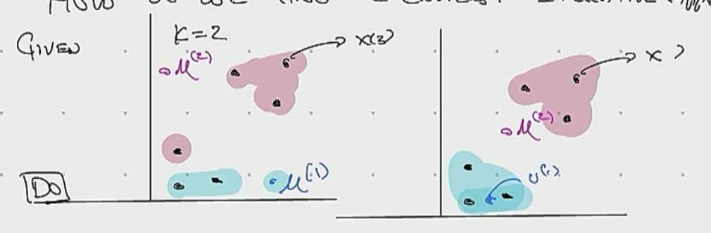

# Table of Contents

1. [Support Vector Machines](#1)
2. [Unsupervised Learning](#2)

## Support Vector Machines

We have a space with negative and positive examples. The problem is to separate the samples using a straight line. And then line is drawn with the view of putting the widest street that separates the positive from the negative examples. (The margin that I drawn is the smallest distance to the closest point)
 

We want to create a decision rules that use that decision boundary

Imagine a vector $\vec{w}$ constraint to be perpendicular to the medium line of the street. And the we have an unkown vector $\vec{u}$ and we are interested in understanding if that vector is on the right side or on the left side of the steet. We can project $\vec{u}$ down to the one that is perpendicular to the street because then, we will have the distance in the $\vec{w}$ direction and the further out we go the closer we'll get to being on the right side of the street.
So we can say
$$
\vec{w} \cdot \vec{u} \geq c
$$

The dot product take the projection onto w and the bigger that projection is, the further out along this projection will lie and eventually it will be so big that the projection crosses the median line of the street, and we'll say it must be a positive sample.
Without loss of generality we can say that 

$$
\vec{w} \cdot \vec{u} + b \geq c \space  \text{THEN +}
$$

$$
c = -b
$$
That's our decision rule. 

So we define that for a positive sample this equation is true
$$
\vec{w} \cdot \vec{x_+} +b \geq 1
$$
Likewise for a negative sample

$$
\vec{w} \cdot \vec{x{_-}} +b \leq -1
$$

Let's introduce another variable for mathematical convenience

$y_i$ such that $y_i = 1$ for positive samples and $y_i = - 1$ for negative samples.

So:

$$
y_i(\vec{w} \cdot x_i + b) \geq 1 \\
y_i(\vec{w} \cdot x_i +b) - 1 \geq 0
$$

And 
$y_i(\vec{w} \cdot x_i +b) - 1 = 0$ for $x_i$ in the GUTTER

The goal is to arrange for the line to be such at the street separating the pluses from the minuses as wide as possible. So we need to express the distance between the two gutters.

We can consider the difference between the two vectors $\vec{x_+} - \vec{x_-}$ and project the difference to a unit vector that is perpendicular to the straight line.

$$
\text{WIDTH} = (\vec{x_+} - \vec{x_-})\cdot \frac{\vec{w}}{||w||}) 
$$

$$
\frac{(1 - b) + (1 + b)}{||w||} = \frac{2}{||w||}
$$

And this represent the width of the street and we want to maximize that quantity

$\text{MAX} \space \frac{2}{||w||}$ equals to $\text{MIN} \space ||w||$ equals to $\text{MIN} \frac{1}{2} ||w||^2$. We have also a contraint that is:

$$ 
y_i(\vec{w} \cdot x_i + b) \geq 1 \\
$$

We’ve now transformed the problem into a form that can be efficiently
solved. The above is an optimization problem with a convex quadratic objective and only linear constraints. Its solution gives us the optimal margin classifier.

### Lagrange duality
Consider a problem of the following form:
$$
min_w f(w) \\
\text{s.t} \space h_i(w) = 0, i = 1,...,l
$$
This problem can be solved with a method called the Lagrange multipliers. The Langrangian is defined to be:

$$
L(w,\beta) = f(w) + \sum_{i}^{l}\beta_i h_i(w)
$$

Here, the $\beta_i$'s are called the **Lagrange multipliers**. We would then find and set $L$'s partial derivatives to zero

$$
\frac{\partial L }{\partial w_i} = 0; \space \frac{\partial L}{\partial \beta_i} = 0
$$

and solve for $w$ and $\beta$.
### Primal optimization problem

In this section, we will generalize this to constrained optimization problems in which we may have inequality as well as equality contraints. Due to 
In order to maximize the size of the street we're going to maximize the following quantity (lagrange multipliers)
$$
min_w f(w) \\
\text{s.t} \space g_i(w) \leq 0, \space i = 1,...,k \\
h_i(w) = 0, \space i = 1,...,l.
$$
To solve it, we start by defining the **generalized Lagrangian**

$$
L(w, \alpha, \beta) = f(w) + \sum_{i = 1}^{k}\alpha_i g_i(w) + \sum_{i=1}^l(\beta_i h_i(w))
$$

Here, the $\alpha_i$'s and $\beta_i$'s are the Lagrange multipliers.  The generalized Lagrangian correspond to the dual problem

$$
\text{maximize} \space L(w,\alpha, \beta) \space \text{s.t} \space \alpha \geq 0
$$

In our case we have that:

$$
L =  \frac{1}{2} ||\vec{w}||^2 - \sum_{}^{} \alpha_i [y_i(\vec{w} \cdot \vec{x_i} + b) - 1]
$$

So we're going to compute the partial derivative

$$
\frac{\partial L}{\partial \vec{w}} = \vec{w} - \sum \alpha_i y_i x_i = 0 \Rightarrow \vec{w} = \sum_{i} \alpha_i y_i \vec{x_i}
$$

This tells us that the vector $w$ is a linear sum of the samples. 
**BUT NOT ALL** the samples, because some alphas could be zero.
We can differentiate also for $b$

$$
\frac{\partial L}{\partial b} = - \sum \alpha_i y_i = 0 \Rightarrow \sum \alpha_i y_i = 0
$$

If we compute the differentation also for alpha

$$
L = \frac{1}{2}||\vec{w}||^2 - \sum\alpha_i[y_i(\vec{w}\cdot \vec{x_i} + b) - 1] \\
\\
\frac{\partial L}{\partial \alpha} = [y_i(\vec{w}\cdot \vec{x_i} + b) - 1] = 0
$$

Now that we got a value for $w$ we can substitute the formula in $L$

$$
L = \frac{1}{2}\left(\sum\alpha_i y_i \vec{x_i}\right)\left(\sum\alpha_i y_j \vec{x_j} \right) - \sum\alpha_i y_ix_i \left(\sum\alpha_j y_j x_j \right) - \sum\alpha_i y_ib + \sum \alpha_i
$$

And $\sum\alpha_i y_ib = 0$ because of the partial derivative with the respect of b

The Lagrangian can be rewrited as

$$
L = \sum \alpha_i - \frac{1}{2}\sum_{i} \sum_{j} \alpha_i \alpha_j y_i y_j \vec{x_i}\cdot \vec{x_j}
$$

We're trying to find a maximum of $L$ and what I discovered that the optimization depends only on the dot product of pairs of samples $x_i\cdot x_j$ 
So now, my decision rule with this expression for w is going to be
$$
\sum \alpha_i y_i \vec{x_i}\cdot \vec{u} + b \geq 0 \rightarrow +
$$

So we discovered that the decison rules depends only on the dot product of those sample vectors and the unknown.

### Non Linear separable data

The derivation of the SVM as presented so far assumed that the data is linearly separable. When data are non-linearly separable, we may get a separation between classes with a hyperplane only allowing that, after having defined the separating hyperplane, some pattern of the training set with positive label are classified as negative and viceversa. We must accept that some constraints are **violated**

We introduce a **slack** variable $\xi_i$ for each constraint, in order to allow an error tolerance:
$$
y^{(i)}(w^{T}\cdot x^{i} + b) \geq 1 - \xi^{i}
$$
An additional term C is introduced in the cost function to penalize misclassification errors.

$$
\frac{1}{2}||w||^2 + C \sum_{i=1}^m\xi^{(i)}
$$

The $\xi_i$ are cost variables proportional to how far the misclassified pattern is from the hyperplane. $\xi_i > 1$ indicates a misclassification error.

C (**regularization** parameter) lets to control the trade-off between hypothesis space complexity and the admissible number of errors. A big value for C gives a stronger penalization to errors. The optimization problem to solve becomes:

Minimize: 
$$
\frac{1}{2}||w||^2 + C \sum_{i=1}^m\xi^{(i)} \\
\space \text{s.t} \\
y^{i}(w^{T}\cdot x^{i} + b) \geq 1 - \xi^{(i)} \\
\xi^{(i)} \geq 0
$$
The dual problem now becomes:

$$
max_{\alpha} \sum_{i=1}^{m}\alpha_i - \frac{1}{2}\sum\alpha_i\alpha_j y_i y_j x_i^T x_j \\
\text{s.t. } 0\leq \alpha_i \leq C \text{ and }  \sum_{i=1}^{m}\alpha_i y_i = 0
$$
The dual variables are now bounded with C. The proposed solution could not be enough. It does not guarantee good performances since a hyperplane can only represent a dichotomy in the space of instances/patterns.

### Cover's theorem
Cover's theorem state that, a complex pattern classification problem, cast in a high dimensional space nonlinearly, is more likely to be linearly separable than in a low dimensional space, provided that the space is not densely populated.
Or in simple terms, given a set of training data that is not linearly separable, one can transform it into a training set that is linearly seperable by mapping it into a possibly higher dimensional space via some non linear transformation.

1. Patterns (input space) are mapped into a space with (much) higher dimension (feature space) through kernel functions;
2. The optimal hyperplane is defined within this feature space

In this case the samples are not linearly separable and we are not able to find a solution for our problem, but we can move to another space that is more convenient for our purposes:

$$
\vec{x} \Rightarrow\phi(\vec{x})
$$

For our optimization problem now all we need is a function $K$ that corresponds to the dot product between the samples in the new space.

This function $K$ is called **kernel function** and we have no need to compute the transformation function $\phi(\vec{x_i})$
$$
K(x_i,x_j) = \phi({\vec{x_i}})\cdot \phi(\vec{x_j})
$$

### Kernel trick
To solve the optimization problem, the product $\phi({\vec{x_i}})\cdot \phi(\vec{x_j})$ does not have to be explicitly computed in the feature space once we find a kernel function (specifically a positive definite kernel).

$$
K(x_i,x_j) = \phi({\vec{x_i}})\cdot \phi(\vec{x_j})
$$

The kernel is a function that returns the (scalar) product of projections: it avoids you to explicitly compute the projection and make the product between the projected vectors. The explicit form of the transformation function may be ignored.

If a kernel function is defined, that is a function such that: 
$$
K(x_i,x_j) = \phi({\vec{x_i}})\cdot \phi(\vec{x_j}) = \sum_{k=1}^{m}\phi(\vec{x_i})\cdot(\phi(\vec{x_j}))
$$

The optimization problem becomes:

$$
max_{\alpha}\sum_{i=1}^{m}\alpha_i - \frac{1}{2}\sum_{i,j = 1}^{m} \alpha_i\alpha_j y_i y_j k(x_i,x_j) 
$$
Such that:

$$
0 \leq \alpha_i \leq C \text{ and } \sum_{i=1}^{m}\alpha_i y_i = 0
$$

The projection $\phi(\vec{x_i})$ into the feature space must not be explicitly computed. 
I should compute the scalar product $\phi(\vec{x_i})\cdot(\phi(\vec{x_j}))$, but I don't have to, since I can indirectly obtain it with the kernel function.

### Kernel examples
Linear kernel

$$
(\vec{u}\cdot \vec{v})
$$

Polinomial kernel

$$
(\vec{u}\cdot \vec{v} + 1)^d
$$

Multi-Layer Perceptron tanh

$$
tanh(b(\vec{u}\cdot\vec{v} - c))
$$

Radial basis function (RBF) kernel 

$$
e^{- \frac{||x_i - x_j||}{\sigma}}
$$

Gaussian Radial basis function kernel

$$
e^{- \frac{(x_i - x_j)^2}{2\sigma^2}}
$$

### Parameters tuning
To use Support Vector Machines you have to define
- the kernel function;
- potential parameter of the kernel function;
- The value for the regularization parameter C.

General rules for the set up do not exist, but you should make your choice on a validation set, usually through cross validation.

### Advantages of SVMs
- There are no local minima (the optimization problem is quadratic -> $\exists$ ! optimal solution)
- The optimal solution can be found in polynomial time.
- There are few parameters to set up (C, type of kernel and specific kernel parameters)
- Solution is stable (ex. there is no problem of randomly initializing of weights just as in Neural Networks)
- Solution is sparse: it just involves support vectors

### SVM Online resources
- https://www.youtube.com/watch?v=_PwhiWxHK8o
- https://www.youtube.com/watch?v=xpHQ6UhMlx4

## Generalized Linear Models
### Basic functions

It is usual that our data cannot be approximated to a linear function. What we need is to find a way to model non linear relations without increasing too much the complexity of the algorithm.

The main limiting characteristics of linear regression is the linearity of parameters

$$
h(x) = \sum_{i = 0}^n \theta_i \cdot x_i = \theta^T x
$$
h(x) keeps a linear relation w.r.t the features space X. This linearity represents a limitation of the expressiveness of the model because the hypothesis is only able to approximate linear functions of the input. GLMs represent an extension to linear models that allow non linear transformations of the input
$$
h(x) = \sum_{i=0}^{n}\theta_i \cdot x_i = \theta^Tx
$$

h(x) keeps a linear relation w.r.t the features space X. This linearity represents a limitation of the expressiveness of the model because the hyporthesis is only able to approximate linear functions of the input. GLMs represent an extension to linear models that allow nonlinear transformations of the input

$$
h(x) = \sum_{i=0}^{n}\theta_i \cdot \psi(x_i) = \theta^T \psi(x)
$$

Phi are called basic functions
Example $x_i,x_2,x_3 \rightarrow x_1,x_2,x_3,x_1x_2,x_1x_3,x_1^2,x_2^2,x_3^2$

## SVM notes from Waterloo lecture
Support vector machines will find a linear separator such that we have the same distance for point on one side and point of the other side and line is gonna be right in the middle. The point that are the closest are called support vector.
And support vector tells us where to put the line such as it has the same distance and distance is the maximum we can obtain. 

## Unsupervised Learning (Stanford CS229 Notes)

### K-Means
In the supervised setting we get points with labels that we can separate with a line and with a supervised learning algorithm. In unsupervised we have the points but we don't have the labels. Unsupervised learning is harder so we have to allow stronger assumptions and we're gonna have to assume that there are some kind of latent or hidden structure and we're gonna have to allow weaker guarantees. (Guess number of cluster for example and assume that there is some cluster in our data).

So we have some data and set up the number of cluster e.g $K=2$ and our goal is to find the cluster.
So given a dataset with points $x^{(1)} \text{ ... } x^{(n)} \in \mathbb{R^d}$ and $K$ # of cluster, we find an assignment to point to cluster in this way $C^{(i)} = j$ means that the point i belong to cluster j. Where i = 1 ... n and j = 1 ... k.

So we start assigning points to cluster, for example $C^{(3)} = 2$ means that point 3 is in cluster 2.

#### How do we find the clusters?

We use and iterative approach. So we're going to start by randomly picking cluster centers for each cluster and find the optimal one in which all the points belonging to the cluster are closer to the center than they are to any other center. 
So the first step of the algorith is
1. Randomly initialize center cluster points $\mu^{(1)}$ and $\mu^{(2)}$ (They don't have to be point in the dataset)
2. Assign each point to a cluster by considering the distance to each center cluster $C^{(i)} = argmin_{j=1...k} ||\mu^{(j)} - x^{(i)}||^2$
3. I compute new cluster centers

And I repeat the step 2 and step 3 until there are no more changes.
The cluster center can be computed in this way
$$
\mu^{(j)} = \frac{1}{|\Omega_j|} \sum_{i \in \Omega_j} x^{(i)} \text{ s.t } \Omega_j = {i:C^{(i)} = j}
$$

Notice that if the point assignment doesn't change in step 2 the center will not change (step 3).

The first question is: Does it terminate? and the answer is yes. 

$$
J(C,\mu) = \sum_{i=1}^N ||x^{(i)} - \mu^{C^{(i)}}||^2
$$
That is, the distance between a point and its cluster center is actually monotonically decreasing. So the oscillation can happen (you can basically do grandient descent on this) but it converges to something but it does not converge necessarily to a global minimizer

#### How do you choose k?

There is no one right answer (modeling question).

#### Professor slide 

**Objective Function(L)**
The K-means algorithm aims to minimize the within-cluster sum of squares, which measures the distance between each data point $x^{(i)}$ and the centroid $\mu_k$ of the cluster it belongs to.
The objective function is defined as:

$$
L = \sum_{k=1}^{K}\sum_{i=1}^{m} a_{ik}||x^{(i)} - \mu_k||^2
$$

- $K$: The number of clusters.
- $m$: The number of data points.
- $a_{ik}$: A binary variable, which is 1 if data point $x^{(i)}$ is assigned to cluster k, and 0 otherwise.
- $x^{(i)}$ : The i-th data point in the dataset
- $\mu_k$: The centroid (mean) of the k-th cluster

The algorithm attempts to minimize L, which is the total sum of squared distances between each data point and the centroid of the cluster of which it belongs.

**Expectation Step**

In this step, the algorithm assigns each data point $x^{(i)}$ to the nearest cluster centroid $\mu_k$. Mathematically, it computes the binary assignment variable $a_{ik}$:

$$
a_{ik} = 
\begin{cases}
1 \text{ if k = arg min}_l ||x^{(i)} - \mu_l||^2 \\
0 \text{ otherwise }
\end{cases}
$$

This means that for each data point, the cluster index k is chosen such that the distance between the point $x^{(i)}$ and the centroid $\mu_k$ is minimized. The variable $a_{ik}$ will be 1 if the point is assigned to cluster k, and 0 otherwise.

**Maximization Step**

Once the assignments are made, the centroids of the clusters are updated to reflect the new mean position of the points in each cluster. The update for the $k-th$ cluster centroid $\mu_k$ is given by:

$$
\mu_k = \frac{1}{n_k}\sum_{i:x_i\in C_k}x^{(i)}
$$

- $n_k = \sum_{i=1}^{m} a_{ik}$: The number of points assigned to cluster k.
- $C_k$: The set of points assigned to cluster k.

The new centroid $\mu_k$ is the average of all the points currently assigned to cluster k. This update ensures that the centroid moves towards the center of the points assigned to it.

**Iteration**
The algorithm repeats the Expectation Step and the Maximization step alternately:
1. In the Expectation Step it assigns points to the nearest cluster.
2. In the M-step, it updates the cluster centroids to the mean of the assigned points.

This process continues until the assignments no longer change, meaning the algorithm has

### Multivariate Gaussian

A **Multivariate Gaussina distribution** extends the concept of a normal distribution to multiple dimension. It is characterized by a **mean vector** and a **covariance matrix**.
#### Gaussian (Normal) distribution

In a Gaussian (Normal) distribution we have $x \in \mathbf{R}$ that is our random variable and $x$ has a Gaussina distribution with mean $\mu$ and variance $\sigma^2$. We can express this fact with this notation $x \sim \mathcal{N}(\mu, \sigma^2)$.
The formula for the probability is 

$$
p(x;\mu,\sigma^2) = \frac{1}{\sqrt{2\pi}}e^{\frac{-(x - \mu)^2}{2\sigma^2}}
$$

##### Parameters estimation

Given a dataset : ${x^{(1)},x^{(2)},...,x^{(m)}}$
We can compute the empirical mean and variance by:

$$
\mu = \frac{1}{m}\sum_{i=1}^{m} x^{(i)} \\
\sigma^2 = \frac{1}{m}\sum_{i=1}^{m}(x^{(i)} - \mu)^2
$$

#### Multivariate Gaussian (Normal) distribution

For the multivariate case we define the following quantities

$$
x \in \mathbf{R^n} \\
\mu \in \mathbf{R^n} \\
\sum \in \mathbf{R^{nxn}} \text{ covariance matrix }
$$

And our probability will be:

$$
p(x;\mu;\sum) = \frac{e^{\left(-\frac{1}{2}(x - \mu)^T \sum^{-1}(x-\mu)\right)}}{\sqrt{(2 \pi)^n |\sum|}}
$$

##### Example: Height and Weight in a Population (Optional Reading)

Let's assume we want to model the height and weight of individuals in a population using a 2D multivariate Gaussian distribution. We'll desribe the joint distribution of these two variables using:
- A  mean vector representing the average height and weight
- A covariance matrix representing the variance in height, variance in weight, and how the two variables are correlated.

1. Mean Vector

The mean vector $\mu$ consist of the mean of the two variables:
$$
\mu = 
\left[
    \begin{aligned}
    & \mu_{height} \\
    & \mu_{weight} \\
    \end{aligned}
\right]
$$

For example:

$$
\mu = 
\left[
    \begin{aligned}
    & 170 \text{ cm (average height)} \\
    & 70 \text{ kg (average weight)} \\
    \end{aligned}
\right]
$$

2. Covariance Matrix

The covariance matrix $\sum$ contains information about the variances of each variable and their covariance:

$$
\sum = 
\begin{bmatrix}
\sigma_{height^2} & Cov(height, weight) \\
Cov (height, weight) & \sigma_{weight}^2
\end{bmatrix}
$$

- $\sigma_{height}^2$ = $100cm^2$ that is the variance of height, so standard deviation of height $\sigma_{height} = 10 cm$

- $\sigma_{weight}^2$ = $225kg ^2$ that is the variance of weight, so standard deviation of height $\sigma_{weight} = 50$

###### Interpretation
- The covariance matrix indicates that height and weight are positively correlated (Covariance = 50). Taller individuals tend to weigh more.
A positive covariance means that when one variable (height) increases, the other variable (weight) also tends to increase.

For a population described by this bivariate Gaussian distribution:

- Average height = 170 cm
- Average weight = 70 kg
- Height standard deviation = 10 cm
- Weight standard deviation = 15 kg
- Positive correlation between height and weight (Covariance = 50).

If you plot a 2D contour of this distribution, it would look like elliptical contours centered around the mean vector (170 cm, 70 kg), with the major axis of the ellipse tilted due to the positive correlation between height and weight.

The major axis of the elliptical contours in a Multivariate Gaussian distribution is determined by the direction of the greatest variance (or spread) of the data. To determine whether the major axis is aligned more with weight or height, we need to look at both the variances and the covariance between the two variables.

In our example we have that

$$
\sum = 
\begin{bmatrix}
100 & 50 \\
50 & 225
\end{bmatrix}
$$

1. Variance Comparison: The variance in weight (225) is larger than the variance in height (100). This suggests that there is more spread in the weight data than in the height data, which is an initial clue that the major axis might be aligned more with weight.

2. Covariance: The positive covariance (50) between height and weight indicates that the two variables are positively correlated. This means that when height increases, weight tends to increase as well. The ellipse is tilted upward due to this correlation.

###### Eigenvalues and Eigenvectors

To rigorously determine the direction of the major axis, we would compute the eigenvalues and eigenvectors of the covariance matrix $\Sigma$ . The eigenvectors give the direction of the principal axes (major and minor), and the eigenvalues indicate the magnitude of variance along these axes.

1. Larger eigenvalue: Corresponds to the major axis (the direction of maximum variance).

2. Smaller eigenvalue: Corresponds to the minor axis (the direction of minimum variance).

Since the variance in weight is larger than the variance in height, we can reasonably expect that the major axis will be closer to the direction of weight. However, because of the positive covariance, the major axis will be tilted, not perfectly aligned with either height or weight. The direction of the tilt would be somewhere between the two, leaning more toward the weight axis because the variance in weight is higher

In the context of the covariance matrix, the eigenvalue problem is solved by finding the eigenvalues and eigenvectors of the matrix. This allows us to determine the principal axes of the ellipse and how spread out the data is along these axes.

The eigenvalue equation is given by:

$$
\Sigma v = \lambda v
$$

Where:

- v is an eigenvector, representing the direction of one of the principal axes.
- $\lambda$ is an eigenvalue, representing the variance along that direction.

The characteristic equation to find the eighenvalues is:

$$
det(\Sigma - \lambda I) = 0
$$

Where I is the identity matrix.

After solving for the eigen values, we use them to find the eigenvectors, which tell us the direction of the major axes of the ellipse.

Resources
- [Alexander Ihler](https://www.youtube.com/watch?v=eho8xH3E6mE)